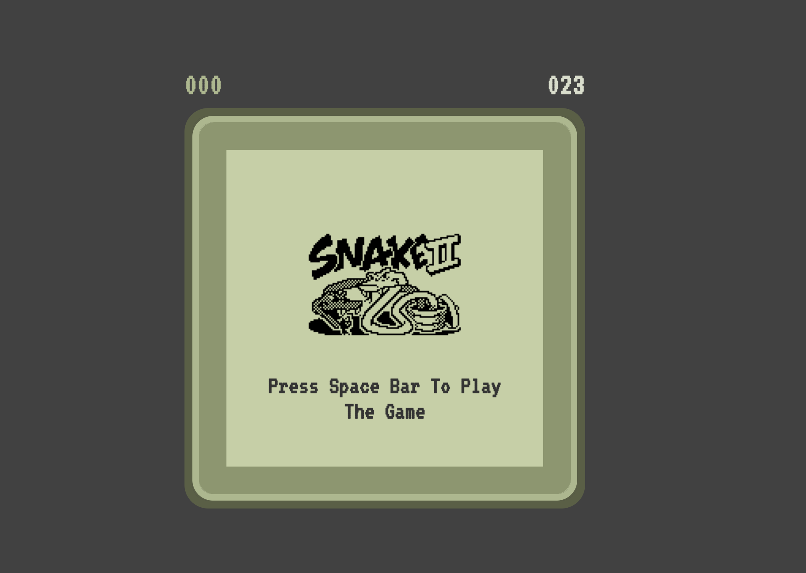
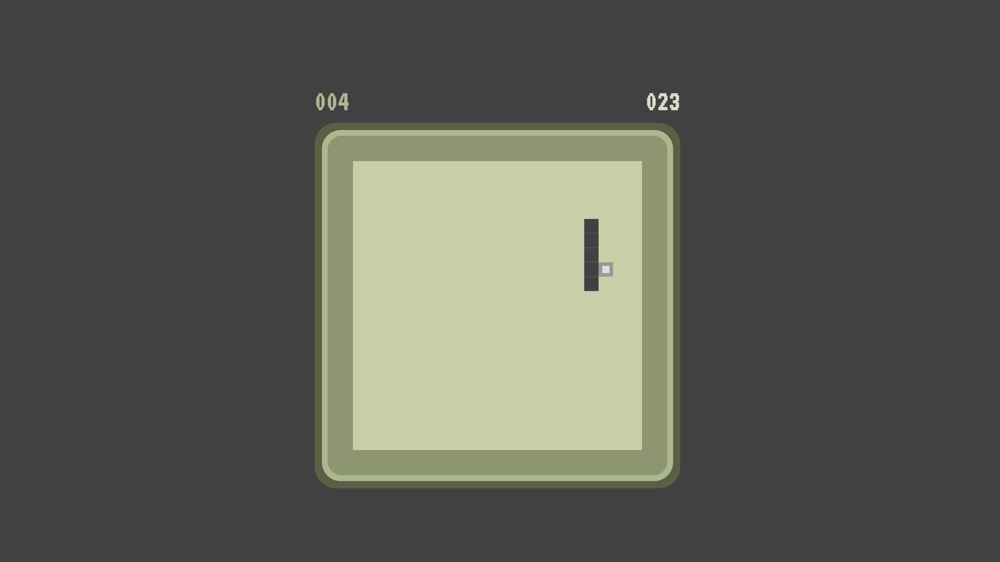

  

# Snake Game

Designed a snake game in order to learn JS fundamentals and apply them to make something interesting and fun.

## Features

- Easy to play
- Amazing UI
- Full-screen mode
- Shows current score and Highest score
- Added Highest Score to local storage

## Screenshots

<table>
  <tr>
    <td></td>
    <td></td>
  </tr>
</table>

## Tech Stack

**Client:** HTML, CSS, JS

## How to Play

- Use `SPACE BAR` to start the game.
- Use `Arrow keys` to navigate

## License

[MIT](https://choosealicense.com/licenses/mit/)
